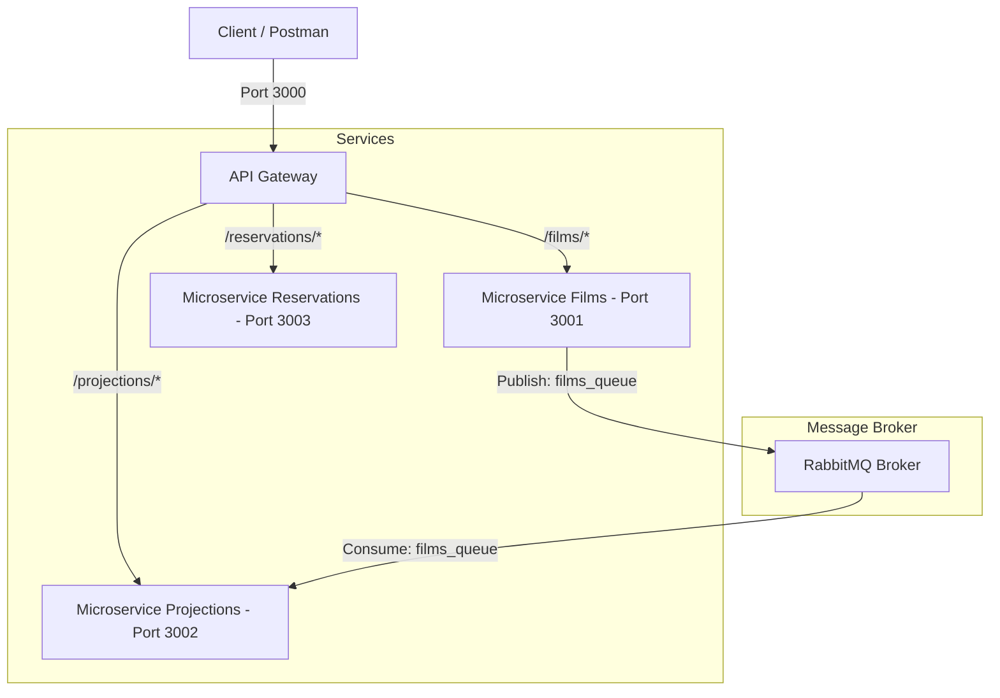

# 🎬 Megaram Casa - Architecture Microservices avec RabbitMQ

Ce projet implémente une architecture microservices robuste et moderne pour le système de gestion de **MEGARAM CASA**. Il permet la gestion des films, la planification des projections hebdomadaires de manière asynchrone, et la réservation de places.

L'écosystème utilise **RabbitMQ** comme broker de messages pour garantir une communication asynchrone et découplée entre le microservice de gestion de films et celui des projections.

---

## 🏗️ Architecture du Système

Le système est composé de quatre briques applicatives distinctes :



### 📋 Détail des Microservices

1. **API Gateway (Node.js/Express - Port 3000)** :
   Point d'entrée unique de l'application. Elle redirige les requêtes vers les bons microservices grâce à `http-proxy-middleware`.
2. **Microservice Films (Node.js/Express - Port 3001)** :
   Permet d'ajouter de nouveaux films. Dès qu'un film est ajouté, il publie l'événement dans la queue `films_queue` de RabbitMQ.
3. **Microservice Projections (Node.js/Express - Port 3002)** :
   Consomme les messages de la queue `films_queue` pour mettre à jour en temps réel la liste des films et générer le planning de projection hebdomadaire.
4. **Microservice Reservations (PHP/Slim - Port 3003)** :
   Gère la création des réservations de places pour les utilisateurs.

---

## 🛠️ Prérequis

Avant de lancer les services, assurez-vous d'avoir installé :
* [Node.js](https://nodejs.org/) (v16 ou supérieur)
* [PHP](https://www.php.net/) (v8.0 ou supérieur) & [Composer](https://getcomposer.org/)
* [RabbitMQ](https://www.rabbitmq.com/) (Lancé localement sur le port par défaut `5672`)

> [!TIP]
> Si vous utilisez Docker, vous pouvez lancer RabbitMQ rapidement avec la commande suivante :
> ```bash
> docker run -d --name rabbitmq -p 5672:5672 -p 15672:15672 rabbitmq:3-management
> ```

---

## 🚀 Installation et Démarrage

### 1. Démarrer le Serveur RabbitMQ
Vérifiez que votre instance de RabbitMQ tourne en arrière-plan.

### 2. Démarrer l'API Gateway
```bash
cd megaram-casa/api-gateway
npm install
npm start
```
*Le Gateway tournera sur `http://localhost:3000`.*

### 3. Démarrer le Microservice Films
```bash
cd megaram-casa/microservice-films
npm install
npm start
```
*Le service tournera sur `http://localhost:3001`.*

### 4. Démarrer le Microservice Projections
```bash
cd megaram-casa/microservice-projections
npm install
npm start
```
*Le service tournera sur `http://localhost:3002`.*

### 5. Démarrer le Microservice Reservations
```bash
cd megaram-casa/microservice-reservations
composer install
php -S localhost:3003 -t src/public
```
*Le service tournera sur `http://localhost:3003`.*

---

## 🧪 Guide de Test de l'API (via API Gateway)

Tous les appels de test peuvent passer directement par le Gateway (`http://localhost:3000`).

### 1. Ajouter un nouveau Film
Ajoute un film et le publie automatiquement sur RabbitMQ :
* **Méthode** : `POST`
* **URL** : `http://localhost:3000/films/api/films`
* **Body (JSON)** :
```json
{
  "id_film": "film_01",
  "titre": "Inception",
  "durée": "148 min",
  "lienTelechargement": "https://example.com/download/inception",
  "date_projection": "2026-06-12T20:00:00.000Z"
}
```
* **Commande cURL** :
```bash
curl -X POST http://localhost:3000/films/api/films \
     -H "Content-Type: application/json" \
     -d '{"id_film": "film_01", "titre": "Inception", "durée": "148 min", "lienTelechargement": "https://example.com/download/inception", "date_projection": "2026-06-12T20:00:00.000Z"}'
```

### 2. Récupérer tous les Films (Microservice Projections)
Permet de s'assurer que le microservice de Projections a bien reçu le film de la queue RabbitMQ :
* **Méthode** : `GET`
* **URL** : `http://localhost:3000/projections/api/projections`
* **Commande cURL** :
```bash
curl http://localhost:3000/projections/api/projections
```

### 3. Récupérer le Planning Hebdomadaire
Filtre les projections planifiées pour les 7 prochains jours :
* **Méthode** : `GET`
* **URL** : `http://localhost:3000/projections/api/projections/planning`
* **Commande cURL** :
```bash
curl http://localhost:3000/projections/api/projections/planning
```

### 4. Créer une Réservation (Microservice Reservations en PHP)
* **Méthode** : `POST`
* **URL** : `http://localhost:3000/reservations/api/reservations`
* **Body (JSON)** :
```json
{
  "id_film": "film_01",
  "id_utilisateur": "user_456"
}
```
* **Commande cURL** :
```bash
curl -X POST http://localhost:3000/reservations/api/reservations \
     -H "Content-Type: application/json" \
     -d '{"id_film": "film_01", "id_utilisateur": "user_456"}'
```
